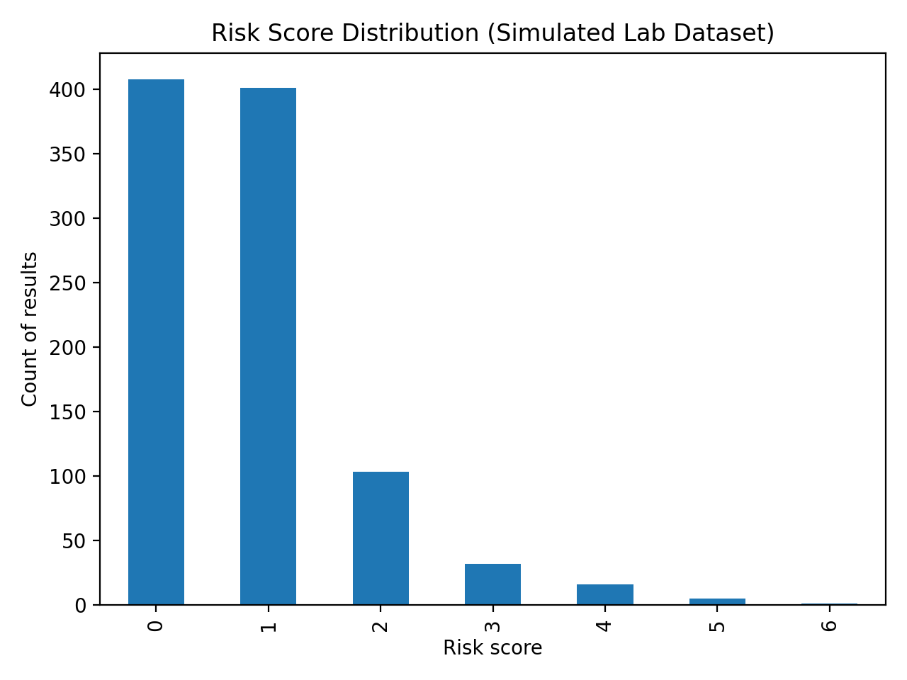
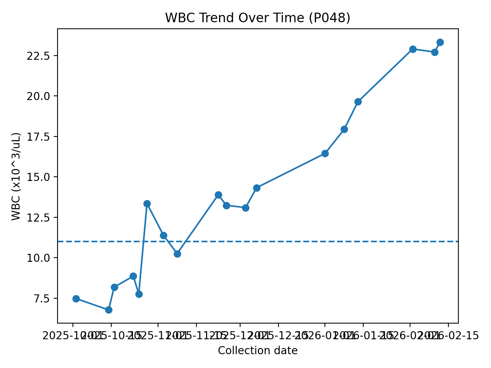
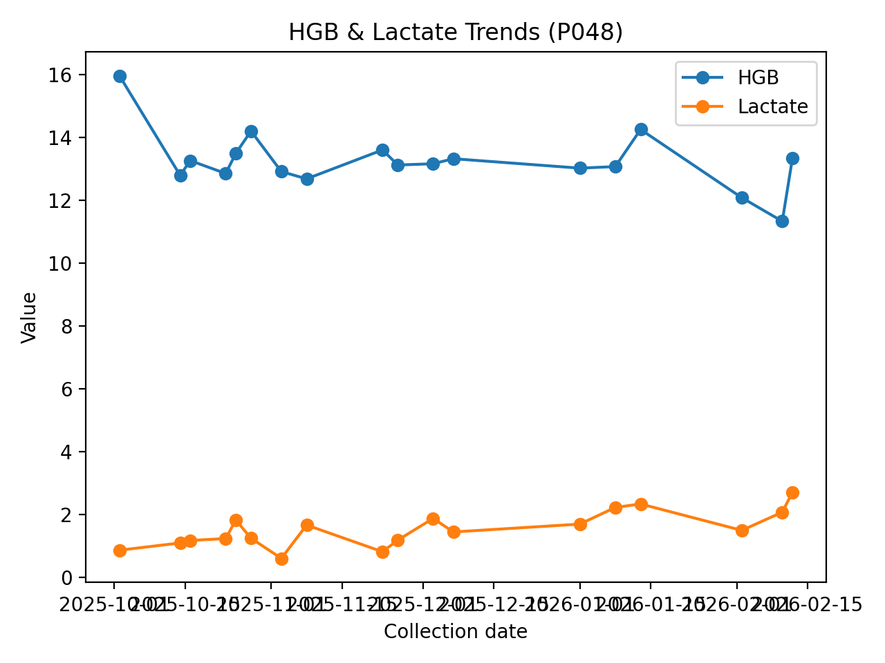

# Healthcare Operational Trend Analysis 🧪📈  
**Trend Detection + Explainable Risk Scoring for AI-Ready Healthcare Data**

**Author:** Branden Bryant  
**Background:** 10+ years Laboratory Medicine | Data Analytics | AI Systems  

---

## 🔎 Project Overview

Healthcare laboratory environments generate thousands of structured test results daily.  
However, without standardized analytics frameworks, organizations often operate reactively — identifying deterioration only after significant abnormal thresholds are crossed.

This case study demonstrates how to transform longitudinal laboratory-style data into **actionable operational intelligence** through:

- Structured data cleaning
- Rolling trend detection
- Explainable multi-parameter risk scoring
- Visualization for decision support
- AI-readiness modeling foundation

---

## 🏥 Business Problem

Clinical lab systems produce high-volume structured data including:

- WBC
- Hemoglobin (HGB)
- Platelets (PLT)
- CRP
- Lactate

Challenges:

- Trend patterns are difficult to monitor consistently
- Abnormal flags are often isolated events
- Operational variability is not easily visualized
- Early warning signals may be missed

**Objective:**  
Design a structured analytical framework that enables proactive operational monitoring instead of reactive response.

---

## 📊 Dataset

File: `data/simulated_lab_data.csv`

This dataset was simulated to reflect realistic longitudinal lab behavior while remaining safe for public sharing.

Includes:
- `patient_id`
- `collection_date`
- `age`
- `sex`
- Lab metrics (WBC, HGB, PLT, CRP, Lactate)
- Simplified reference ranges

---

## 🛠 Tools & Technologies

- Python (pandas, numpy, matplotlib)
- R (tidyverse, lubridate)
- SQL (operational query design)
- Jupyter Notebook
- Structured trend modeling logic

---

## 📈 Methodology

### 1️⃣ Data Preparation
- Converted dates to proper formats
- Validated numeric values
- Standardized reference ranges
- Sorted longitudinal patient records
- Ensured clean dataset structure

---

### 2️⃣ Explainable Risk Scoring Model

Each lab result receives a rule-based score:

| Metric  | Condition           | Points |
|----------|--------------------|--------|
| WBC      | > 11               | +1     |
|          | > 20               | +2     |
| HGB      | Below reference    | +1     |
|          | < 7                | +2     |
| Lactate  | ≥ 1.8              | +1     |
|          | ≥ 2.2              | +2     |
| CRP      | ≥ 10               | +1     |
|          | ≥ 50               | +2     |
| PLT      | < 150              | +1     |
|          | < 50               | +2     |

### Risk Categories:
- **Low:** 0–2  
- **Moderate:** 3–5  
- **High:** 6+

This transparent scoring model creates a foundation for AI-based predictive modeling while maintaining interpretability.

---

### 3️⃣ Trend Detection Logic

Operational indicators implemented:

- Persistent High WBC  
  (Rolling 3-result window above reference high)

- HGB Decline Flag  
  (Slope-based detection across last 5 samples)

These trend signals demonstrate how longitudinal logic provides more insight than single abnormal values.

---

## 📊 Visual Outputs

### Risk Score Distribution


### Example Longitudinal WBC Trend


### Multi-Metric Trend (HGB + Lactate)


---

## 🔬 SQL Operational Queries

See: `sql/analysis_queries.sql`

Includes:
- Risk level distribution
- Frequent abnormal WBC detection
- First vs last trend comparison
- Daily operational averages

These queries simulate dashboard-ready operational reporting.

---

## 🧪 Reproduce the Analysis

### Python

```bash
python -m venv .venv

# Windows:
.venv\Scripts\activate

pip install -r requirements.txt
python src/analyze.py

Outputs are generated in /visuals.

R

Open RStudio and run:

source("r/analysis.R")
📄 Executive Summary (Recruiter Version)

A recruiter-ready PDF summary is available in:

/docs/Healthcare_Operational_Trend_Analysis_Recruiter_Version.pdf

This document provides:

Executive overview

Methodology summary

Key findings

Operational recommendations

AI-readiness framing

💡 Key Insights

Structured data enables measurable trend visibility

Persistent abnormalities provide earlier detection signals

Risk stratification simplifies operational decision-making

Explainable logic supports clinical transparency

Clean data pipelines are foundational for AI systems

## 📊 Quantitative Findings

From the simulated longitudinal dataset (966 total lab results):

- **0.10%** classified as High Risk
- **5.49%** classified as Moderate Risk
- **94.41%** classified as Low Risk

This distribution reflects a predominantly stable population with rare high-severity cases — a realistic operational scenario in many healthcare environments.

Even with low high-risk prevalence, structured trend monitoring enables early identification of deterioration patterns that isolated abnormal flags may miss.

### Class Imbalance Consideration

The low prevalence of High Risk cases mirrors real-world healthcare distributions, highlighting the importance of precision, recall, and ROC analysis in predictive modeling.

🧠 AI-Readiness Perspective

This case study demonstrates how:

Standardized data structures

Longitudinal modeling

Transparent scoring logic

Visual dashboards

create the foundation for predictive modeling and machine learning integration.

It bridges healthcare domain knowledge with scalable analytics design.

🚀 Future Enhancements

Logistic regression classification (High vs Non-High risk)

ROC curve & performance metrics

Interactive dashboard (Plotly or Tableau)

FHIR-style data structuring

Real-time streaming simulation

## 🤖 Machine Learning Extension (Optional Prototype)

To extend this project toward predictive analytics, a logistic regression model can be implemented to predict:

**Target:** High Risk (1) vs Non-High Risk (0)

### Feature Inputs:
- WBC
- HGB
- Lactate
- CRP
- PLT
- Trend indicators (persistent high flag, HGB slope)

This would allow:
- Probability-based risk prediction
- ROC curve evaluation
- Model calibration comparison
- Transition from rule-based to predictive modeling

The current rule-based scoring provides an explainable baseline for supervised learning models.

## 🤖 Model Comparison (Imbalanced Classification)

To address severe class imbalance (~0.62% high-risk prevalence), multiple strategies were evaluated:

| Model | Recall (High Risk) | Precision | ROC AUC |
|--------|-------------------|------------|---------|
| Logistic (Balanced) | 1.00 | 0.25 | 0.9896 |
| Logistic (SMOTE) | 1.00 | 0.25 | 0.9896 |
| Random Forest (Balanced) | 0.50 | 0.50 | 0.9878 |

### Key Insight

- Logistic regression with class weighting successfully detected all high-risk cases.
- Random Forest reduced false positives but missed one high-risk case.
- SMOTE did not improve performance beyond class weighting.

This highlights the real-world trade-off between recall and precision in rare-event healthcare prediction.

### ROC Curve Comparison


📌 About the Author

Branden Bryant
Healthcare Professional → Data Analytics & AI Systems

Focused on building intelligent, explainable, and operationally scalable healthcare analytics systems.dy insight
